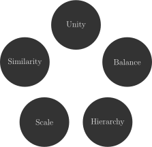
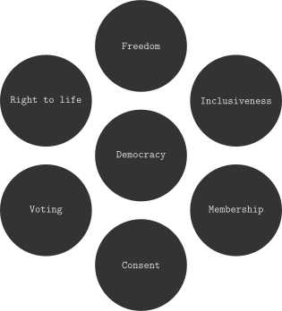

<!--
SPDX-FileCopyrightText: 2021-2 Galagic Limited, et. al. <https://galagic.com>

SPDX-License-Identifier: CC-BY-SA-4.0

figular generates visualisations from flexible, reusable parts

For full copyright information see the AUTHORS file at the top-level
directory of this distribution or at
[AUTHORS](https://gitlab.com/thegalagic/figular/AUTHORS.md)

This work is licensed under the Creative Commons Attribution 4.0 International
License. You should have received a copy of the license along with this work.
If not, visit http://creativecommons.org/licenses/by/4.0/ or send a letter to
Creative Commons, PO Box 1866, Mountain View, CA 94042, USA.
-->

# Concept/Circle

A circle of concepts with (optionally) one in the centre. It can be rotated
and the font changed. You can try it on our website
[here](https://figular.com/tryit/concept/circle/).

* [Suggested Purpose](#suggested-purpose)
* [Usage](#usage)
* [Limitations](#limitations)
* [Examples](#examples)

## Suggested Purpose

* A circular flow of ideas, concepts or workflow.
* A collection of concepts of equal weight
* A central concept with multiple contributing/ancillary concepts

## Usage

### On the Website

Here's what you should see when you first visit the
[Circle](https://figular.com/tryit/concept/circle/) page:


In the text box you enter a list of concepts, one per line that will be included
in the figure. They will be drawn in sequence starting from the top. Below that
you can alter the rotation of the whole figure, centralise the first item in the
list and alter the font.

### At the Cmdline

The `fig` command expects your data in the first arg and any optional style as a
JSON doc in the second arg:

```bash
fig concept/circle "$(cat << EOF
Democracy
Freedom
Inclusiveness
Membership
Consent
Voting
Right to life
EOF
)" '{ "figure_concept_circle": {  "middle": true, "font": "cmtt" } }'
```

The data should contain at least one line. Each line is put into a 'blob' and
they are drawn in sequence from the top then clockwise around the circle.

The optional JSON styling allows a number of settings, all optional. A full example
of what can be set for the figure looks like this:

```json
{
  "figure_concept_circle": {
    "middle": true,
    "degreeStart": 0,
    "font": cmtt,
  }
}
```

Here's a description of the various parameters:

|Name|Type|Default|Description|
|----|----|-------|-----------|
|middle|Bool|False|Put the first blob in the centre of the circle.|
|degreeStart|Integer|0|Rotate the circle by a number of degrees|
|font|String|cmr (Computer Modern Roman)|Specifies a font from the [Computer Modern (wikipedia.org)](https://en.wikipedia.org/wiki/Computer_Modern) font family. Further documentation is needed here. Other possible values include: `cmss` for Computer Modern Sans and `cmtt` for Computer Modern Typewriter. |

You can also style the primitive circles of which the figure is composed, e.g.

```json
{
  "circle": {
    "background_color": "blue",
    "border_color": "pink",
    "border_width": 2,
    "border_style": "dashed"
  }
}
```

See [Figular#Styling](../../Figular.md#Styling) for more on styling primitives.

## Limitations

* Each concept/blob is visualised as a single line of text. Long lines cause big
  circles, this makes the text appear smaller and harder to read. It's best to
  stick to short lines for now.
* Website only: we accept up to 1000 characters of data for now, so big lists
  of concepts will return an error. Let us know if this is a problem for you as
  we can adjust this.

## Examples



[Elements of the design of the art (wikipedia.org)](https://en.wikipedia.org/wiki/Visual_design_elements_and_principles#Elements_of_the_design_of_the_art)

### On the Website

Ensure 'centralise: first item' is **not** ticked then enter the following into
the text box:

```text
Unity
Balance
Hierarchy
Scale
Similarity
```

### At the Cmdline

```bash
fig concept/circle \
  blob=Unity blob=Balance \
  blob=Hierarchy blob=Scale blob=Similarity
```

---



[The cornerstones of Democracy (wikipedia.org)](https://en.wikipedia.org/wiki/Democracy)

### On the Website

Ensure 'centralise: first item' is ticked then enter the following into the text
box:

```text
Democracy
Freedom
Inclusiveness
Membership
Consent
Voting
Right to life
```

### At the Cmdline

```bash
fig concept/circle \
  blob=Democracy blob=Freedom \
  blob=Inclusiveness blob=Membership \
  blob=Consent blob=Voting \
  "blob=Right to life" \
  middle=true font=cmtt
```
