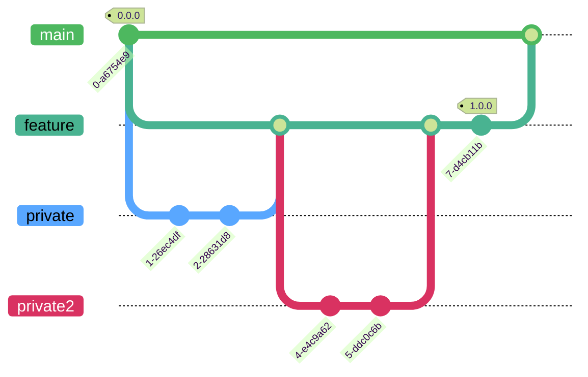

# Feature flow

This project uses
**[GitHub flow](https://docs.github.com/en/get-started/quickstart/github-flow){:target="\_blank"}**
as it's main workflow model. Simplified visualization can be seen on graph
below:



## Clone repository

!!! Hint

    You can skip this step if you already have a clone

```
git clone https://github.com/Argmaster/nneve.git
```

## Checking out main branch

Make sure we are on `main` branch.

```
git checkout main
```

## Pull changes from origin

!!! Hint

    You can skip this step if you just cloned the repository

```
git pull --ff
```

## Create feature branch

Create new branch for our feature called (replace with whatever you want)
`feature_name`. `feature/` prefix is required because of convention.

[Learn about branches](https://git-scm.com/book/en/v2/Git-Branching-Basic-Branching-and-Merging){:target="\_blank"}

```
git checkout -b feature/feature_name
```

## Check repository status

```
git status
```

Result should be similar to this:

```
On branch feature/feature_name
nothing to commit, working tree clean
```

## Commit-test-push cycle

Your work on a feature should be divided into many steps during which you will
add new units to the system. Each unit should have a set of tests to verify its
operation.

1. ### Formatting & Quality checks

   Run code quality checks with tox to quickly fix most obvious issues in your
   code.

   ```
   tox -e check
   ```

   ```
   tox -e check
   ```

2. ### Run test suite for Python interpreter versions you have locally

   Run [test suites](/develop/tox_basics/#pyxx){:target="\_blank"} on available
   interpreters with

   ```
   tox -e py37
   ```

   If the tests fail, you have to repeat steps 1 and 2. Omission of the
   corrections will result in your changes being rejected by the CI tests
   executed for the pull request.

3. ### Add all changes to staging area with

   ```
   git add *
   ```

   You can list file paths instead of using the asterisk symbol if you know you
   can add many unwanted files. If these unwanted files regularly appear in the
   codebase, add them to the `.gitignore` file.

4. ### Check staging area

   ```
   git status
   ```

   If any files staged for commit shouldn't be there, unstage them with

   ```
   git restore --staged <file>
   ```

5. ### Commit changes

   Now use commit command to send changes to git history

   ```
   git commit
   ```

   This command will open text editor for you, waiting for commit description.
   You can use

   ```
   git commit -m "commit message"
   ```

   to add commit title and omit long description. The commit title should not
   be longer than 50 characters.

   - [How to write a Git Commit Message](https://cbea.ms/git-commit/){:target="\_blank"}

   - [Good Commit Messages: A Practical Git Guide](https://www.freecodecamp.org/news/writing-good-commit-messages-a-practical-guide/){:target="\_blank"}

6. ### Push changes to remote branch

   ```
   git push -u origin feature/feature_name
   ```

   For each subsequent push from this branch, you can omit
   `-u origin feature/feature_name`

   ```
   git push
   ```

## Create pull request

Visit
[pull requests](https://github.com/Argmaster/nneve/pulls){:target="\_blank"}
and create
[PR](https://docs.github.com/en/get-started/quickstart/github-glossary#pull-request){:target="\_blank"}
for you feature. Read in
[GitHub docs](https://docs.github.com/en/pull-requests/collaborating-with-pull-requests/proposing-changes-to-your-work-with-pull-requests/creating-a-pull-request){:target="\_blank"}
about pull requests.

## Request review & wait for CI checks

Now you can request a pull request review, as it's described
[here](https://docs.github.com/en/pull-requests/collaborating-with-pull-requests/proposing-changes-to-your-work-with-pull-requests/requesting-a-pull-request-review){:target="\_blank"}.
Before your changes can be merged into another branch, at least one person
should see them, and share their thoughts about them with you. If you are
prompted to make corrections, do so immediately and do not apply your changes
without fixes. Go back to [Commit-test-push](#commit-test-push-cycle).

You changes should also pass all tests ran by CI system
([Github Actions](https://docs.github.com/en/actions){:target="\_blank"}). If
the tests fail, corrections will also be required before continuing.

## Merge PR

After receiving a positive response from the reviewer and passing the tests,
the pull request can be merged.

[About merge conflicts](https://docs.github.com/en/pull-requests/collaborating-with-pull-requests/addressing-merge-conflicts/about-merge-conflicts){:target="\_blank"}

[About pull request merges](https://docs.github.com/en/pull-requests/collaborating-with-pull-requests/incorporating-changes-from-a-pull-request/about-pull-request-merges).
